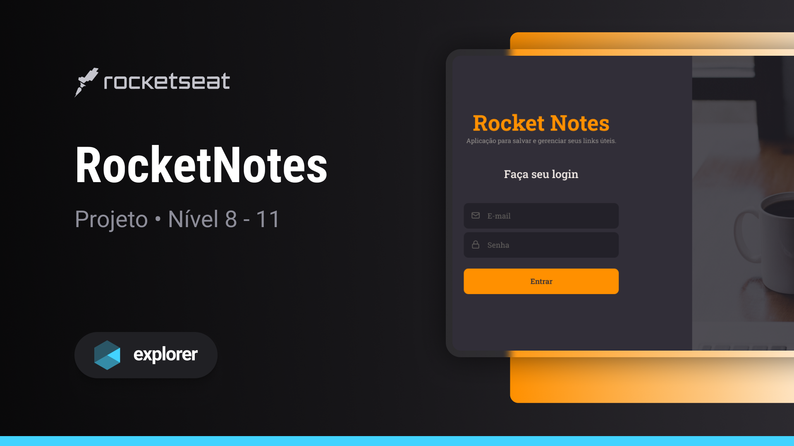

<h1 align="center">RocketNotes</h1>

  Projeto retirado do programa Explorer, um programa de estudo exclusivo promovido pela Rocketseat para o ensino de tecnologias web.

  <a href="#-layout">Layout</a>&nbsp;&nbsp;&nbsp;|&nbsp;&nbsp;&nbsp;
  <a href="#-projeto">Projeto</a>&nbsp;&nbsp;&nbsp;|&nbsp;&nbsp;&nbsp;
  <a href="#-deploy">Deploy</a>&nbsp;&nbsp;&nbsp;|&nbsp;&nbsp;&nbsp;
  <a href="#-principais-recursos">Principais Recursos</a>&nbsp;&nbsp;&nbsp;|&nbsp;&nbsp;&nbsp;
  <a href="#-conta-de-demonstração">Conta de Demonstração</a>&nbsp;&nbsp;&nbsp;|&nbsp;&nbsp;&nbsp;
  <a href="#-estrutura-do-repositório">Estrutura do Repositório</a>&nbsp;&nbsp;&nbsp;|&nbsp;&nbsp;&nbsp;
  <a href="#-contribuições">Contribuições</a>&nbsp;&nbsp;&nbsp;|&nbsp;&nbsp;&nbsp;
  <a href="#%EF%B8%8F-contato">Contato</a>&nbsp;&nbsp;&nbsp;|&nbsp;&nbsp;&nbsp;
  <a href="#-licença">Licença</a>

 

  

 

  

## 🎨 Layout

Você pode visualizar o layout do projeto através [**Desse Link**](https://www.figma.com/file/hbBzycZDR4WGSVWyK5aOqV/RocketNotes/duplicate).

## 💻 Projeto

O RocketNotes é um projeto CRUD que visa fornecer uma experiência de usuário intuitiva e eficiente na criação de anotações. Este aplicativo apresenta um menu interativo e foi desenvolvido para oferecer um serviço de anotações completo. Com uma ampla gama de recursos robustos, os usuários podem desfrutar de uma experiência altamente personalizada ao utilizar o aplicativo.

## 📱 Deploy

Você pode experimentar a aplicação no ar através do seguinte link:

[**Acessar o RocketNotes**](https://kauankarvalho-rocketnotes.vercel.app)

Explore todos os recursos e desfrute da experiência completa!

## 📋 Principais Recursos

### Gerenciamento de Usuário:

- **Cadastro de Conta**: Possibilita aos usuários a criação de uma nova conta, inserindo informações fundamentais como nome, e-mail e senha;

- **Atualização de Dados da Conta**: Capacita os usuários a modificarem suas informações, tais como nome, e-mail, senha e avatar, mantendo-as sempre atualizadas;

- **Exclusão de Conta**: Oferece aos usuários a opção de excluir sua conta, proporcionando um processo direto para encerrar a participação no sistema.

### Gerenciamento de Anotações:

- **Listagem de Anotações e Tags**: Apresenta uma lista abrangente de todas as anotações e tags associadas a um usuário, oferecendo uma visão completa do seu conjunto de informações;

- **Filtragem de Anotações**: Facilita a busca ao fornecer uma lista filtrada por título ou tag das anotações, simplificando a localização de informações específicas desejadas;

- **Criação de Novas Anotações**: Capacita os usuários a criar novas anotações de maneira intuitiva, incluindo título, descrição, links e tags, proporcionando uma experiência flexível e personalizada;

- **Exclusão de Anotações**: Permite aos usuários removerem anotações previamente criadas, garantindo controle sobre o conteúdo armazenado e possibilitando a gestão eficiente de suas notas.

## 🔐 Conta de Demonstração

Para facilitar os testes da aplicação, disponibilizo esta conta de demonstração:

### Usuario Normal:

**E-mail:** `user@email.com`

**Senha:** `1234`

Os usuários comuns têm acesso total à aplicação, no entanto, a conta de demonstração conta com um sistema de segurança que impede a alteração de informações ou exclusão da conta.

Sinta-se à vontade para usar esta conta de demonstração para explorar a aplicação.

> **Oberservação:** Lembre-se de que esta é uma conta de demonstração e não devem ser usada para fins de produção ou para armazenar informações sensíveis.

## 📁 Estrutura do Repositório

Este é um repositório monorepo que contém duas principais pastas:

- **web**: Contém o código fonte do frontend da aplicação.
- **api**: Contém o código fonte da API backend.

## ⚙️ Configuração e Execução

Dentro das pastas `web` e `api`, você encontrará guias detalhados sobre como configurar e executar cada componente individualmente. Certifique-se de seguir as instruções apropriadas para cada parte do projeto.

## 🤝 Contribuições

Agradeço por considerar contribuir para o **RocketNotes**. Contribuições são importantes para melhorar e evoluir o projeto. Aqui estão algumas maneiras pelas quais você pode contribuir.

### Abertura de Issues:

Se você encontrar problemas, bugs ou tiver sugestões de melhorias, sinta-se à vontade para abrir uma issue. Certifique-se de incluir detalhes suficientes para que possamos entender o problema ou a sugestão.

### Envio de Pull Request:

Se você deseja fazer alterações no código, pode criar um fork deste repositório, fazer suas alterações no seu fork e, em seguida, enviar um Pull Request. Certifique-se de descrever as alterações que você fez e explicar como isso beneficia o projeto.

### Melhoria da Documentação:

A documentação é fundamental para manter o projeto fácil de entender. Se você identificar partes do código que precisam de documentação adicional, pode contribuir adicionando comentários claros ou atualizando o README.

### Como Contribuir:

1. Faça um fork deste repositório;
2. Crie uma nova branch para suas alterações: `git checkout -b feature/nome-da-sua-feature`;
3. Faça suas alterações e commit: `git commit -m "Adiciona nova funcionalidade"`;
4. Envie suas alterações para o GitHub: `git push`;
5. Abra um Pull Request para este repositório.

## ✉️ Contato

Se você deseja um projeto comigo, colaborações ou oferecer oportunidades de carreira, fique à vontade para entrar em contato:

- **E-mail**: [kauan.karvalho@outlook.com](mailto:kauan.karvalho@outlook.com)

## 📝 Licença

Este projeto está sob a licença MIT. Consulte o arquivo [**LICENSE**](https://github.com/kauankarvalho/RocketNotes/blob/main/LICENSE) para obter mais detalhes.
