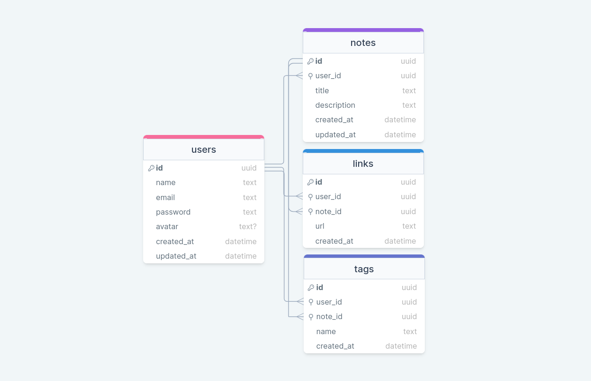

<h1 align="center">RocketNotes API</h1>

<p align="center">
  Projeto retirado do programa Explorer, um programa de estudo exclusivo promovido pela Rocketseat para o ensino de tecnologias web.
</p>

<div align="center">
  <a href="#-introdução">Introdução</a>&nbsp;&nbsp;&nbsp;|&nbsp;&nbsp;&nbsp;
  <a href="#-tecnologias">Tecnologias</a>&nbsp;&nbsp;&nbsp;|&nbsp;&nbsp;&nbsp;
  <a href="#-pré-requisitos">Pré-requisitos</a>&nbsp;&nbsp;&nbsp;|&nbsp;&nbsp;&nbsp;
  <a href="#-instalação-e-configuração">Instalação e Configuração</a>&nbsp;&nbsp;&nbsp;|&nbsp;&nbsp;&nbsp;
  <a href="#-testes">Testes</a>&nbsp;&nbsp;&nbsp;|&nbsp;&nbsp;&nbsp;
  <a href="#-banco-de-dados">Banco de Dados</a>&nbsp;&nbsp;&nbsp;|&nbsp;&nbsp;&nbsp;
  <a href="#-rotas">Rotas</a>&nbsp;&nbsp;&nbsp;|&nbsp;&nbsp;&nbsp;
  <a href="#-contribuições">Contribuições</a>&nbsp;&nbsp;&nbsp;|&nbsp;&nbsp;&nbsp;
  <a href="#%EF%B8%8F-contato">Contato</a>&nbsp;&nbsp;&nbsp;|&nbsp;&nbsp;&nbsp;
  <a href="#-licença">Licença</a>
</div>

<br />

<div align="center">
  
</div>

## 📌 Introdução

O RocketNotes API, oferece uma API robusta e flexível para gerenciamento de notas e tarefas. Essa API permite aos desenvolvedores criar, visualizar, editar e excluir notas de forma eficiente, proporcionando uma experiência intuitiva e eficaz no gerenciamento de informações. Com endpoints bem estruturados, a RocketNotes API facilita a integração com diversas plataformas e aplicativos, permitindo uma variedade de casos de uso.

## 🧪 Tecnologias

Está API foi desenvolvido com as seguintes tecnologias:

- [**JavaScript**](https://developer.mozilla.org/pt-BR/docs/Web/JavaScript)
- [**NodeJS**](https://nodejs.org)
- [**ExpressJS**](https://expressjs.com)
- [**Cors**](https://github.com/expressjs/cors)
- [**Express Async Errors**](https://github.com/davidbanham/express-async-errors)
- [**Multer**](https://github.com/expressjs/multer)
- [**SQLite**](https://www.sqlite.org)
- [**Prisma**](https://www.prisma.io)
- [**JSON Web Token**](https://jwt.io)
- [**bcrypt.js**](https://github.com/dcodeIO/bcrypt.js)
- [**dotenv**](https://www.dotenv.org)
- [**pm2**](https://pm2.io)
- [**Vitest**](https://vitest.dev)
- [**Prettier**](https://prettier.io)

## 📦 Pré-requisitos

Lista de pré-requisitos necessários para que o projeto seja executado com sucesso:

- [**NodeJS**](https://nodejs.org) - Versão 20.0.0 ou superior.
- [**NPM**](https://www.npmjs.com) - Versão 10.0.0 ou superior.

## 🛠️ Instalação e Configuração

Siga os passos abaixo para instalar e configurar a API em um ambiente local:

1. **📥 Clone o repositório:**

   ```bash
   git clone https://github.com/kauankarvalho/RocketNotes.git
   ```

2. **📂 Navegue para o diretório do projeto:**

   ```bash
   cd ./RocketNotes/api
   ```

   > **Oberservação:** Se você utilizar exclusivamente a API, poderá excluir o diretório `web` e arquivo `README` presente na raiz do projeto.

3. **📦 Instale as dependências:**

   ```bash
   pnpm install
   ```

   > **Oberservação:** O gerenciador de pacotes que estou usando é o [**pnpm**](https://pnpm.io), no entanto, você pode optar pelo de sua preferência.

4. **⚙️ Crie um arquivo de configuração:**

   Crie um arquivo `.env` na raiz do projeto e configure as variáveis de ambiente necessárias de acordo com o modelo fornecido em `.env.example`. Por exemplo:

   ```dotenv
   SERVER_PORT=valor
   AUTH_SECRET=valor
   ```

   > **Oberservação:** Altere o `valor` de cada variável de acordo com suas preferências.

5. **▶️ Inicie o servidor:**

   ```bash
   pnpm dev
   ```

   Isso iniciará a API na porta especificada no arquivo `.env`.

6. **🌐 Acesse a API:**

   Abra o navegador ou utilize uma ferramenta como o [**Insomnia**](https://insomnia.rest) para acessar as rotas da API em **http://localhost:3000** (substitua a porta conforme necessário).

   Agora a API está instalada, configurada e em execução no seu ambiente local. Você pode começar a usá-la para testes e desenvolvimento.

## 🔬 Testes

O projeto incorpora testes unitários em cenários de uso específicos, proporcionando uma base segura para a implementação de novas funcionalidades.

Para realizar os testes, basta utilizar o comando: `pnpm test`.

## 🗄️ Banco de Dados

Segue o esquema do banco de dados da API, visualizado por meio da ferramenta [**DrawSQL**](https://drawsql.app).

<div align="center">
  
</div>

## 🧭 Rotas

Aqui estão as rotas disponíveis na API organizados por categorias:

### Login:

#### Criar um login:

- **Método:** POST
- **Rota:** `/login`
- **Corpo da Requisição:**
  ```json
  {
    "email": "e-mail do usuário",
    "password": "senha do usuário"
  }
  ```
- **Resposta:**
  ```json
  {
    "user": {
      "name": "nome do usuário",
      "email": "e-mail do usuário",
      "avatar": "avatar do usuário"
    },
    "token": "token de autenticação do usuário"
  }
  ```

### Usuário:

#### Criar um usuário:

- **Método:** POST
- **Rota:** `/user`
- **Corpo da Requisição:**
  ```json
  {
    "name": "nome do usuário",
    "email": "e-mail do usuário",
    "password": "senha do usuário"
  }
  ```
- **Resposta:**
  ```json
  {
    "status": "success",
    "message": "Conta criada com sucesso"
  }
  ```

#### Atualizar um usuário:

- **Método:** PUT
- **Rota:** `/user`
- **Permissão:** Usuário precisa estar autenticado com o token
- **Corpo da Requisição:**
  ```json
  {
    "name": "nome do usuário",
    "email": "e-mail do usuário",
    "password": "senha do usuário",
    "newPassword": "nova senha do usuário"
  }
  ```
- **Resposta:**
  ```json
  {
    "status": "success",
    "message": "As informações da conta foram atualizadas com sucesso"
  }
  ```

#### Atualizar avatar do usuário:

- **Método:** PATCH
- **Rota:** `/user/avatar`
- **Permissão:** Usuário precisa estar autenticado com o token
- **Conteúdo:** `multipart/form-data`
- **Resposta:**
  ```json
  {
    "avatar": "avatar do usuário"
  }
  ```

#### Excluir um usuário:

- **Método:** DELETE
- **Rota:** `/user`
- **Permissão:** Usuário precisa estar autenticado com o token
- **Corpo da Requisição:**
  ```json
  {
    "password": "senha do usuário"
  }
  ```
- **Resposta:**
  ```json
  {
    "status": "success",
    "message": "Conta excluida com sucesso"
  }
  ```

### Anotações:

#### Listar anotações:

- **Método:** GET
- **Rota:** `/note`
- **Query:** `?title=valor&tag=valor`
- **Permissão:** Usuário precisa estar autenticado com o token
- **Resposta:**
  ```json
  {
    "notes": [
      {
        "id": "id da anotação",
        "title": "título da anotação",
        "tags": ["tag 1", "tag 2"]
      }
      {
        "id": "id da anotação",
        "title": "título da anotação",
        "tags": ["tag 1", "tag 2"]
      }
    ]
  }
  ```

#### Listar anotação específica:

- **Método:** GET
- **Rota:** `/note/:id`
- **Parâmetro:** `id`
- **Permissão:** Usuário precisa estar autenticado com o token
- **Resposta:**
  ```json
  {
    "note": {
      "title": "título da anotação",
      "description": "descrição da anotação",
      "links": ["link 1", "link 2"],
      "tags": ["tag 1", "tag 2"]
    }
  }
  ```

#### Criar anotação:

- **Método:** POST
- **Rota:** `/note`
- **Permissão:** Usuário precisa estar autenticado com o token
- **Corpo da Requisição:**
  ```json
  {
    "title": "título da anotação",
    "description": "descrição da anotação",
    "links": ["link 1", "link 2"],
    "tags": ["tag 1", "tag 2"]
  }
  ```
- **Resposta:**

  ```json
  {
    "status": "success",
    "message": "Anotação criada com sucesso"
  }
  ```

  #### Excluir anotação:

- **Método:** DELETE
- **Rota:** `/note/:id`
- **Parâmetro:** `id`
- **Permissão:** Usuário precisa estar autenticado com o token
- **Resposta:**
  ```json
  {
    "status": "success",
    "message": "Anotação excluida com sucesso"
  }
  ```

### Tags:

#### Listar tags:

- **Método:** GET
- **Rota:** `/tag`
- **Permissão:** Usuário precisa estar autenticado com o token
- **Resposta:**
  ```json
  {
    "tags": ["tag 1", "tag 2", "tag 3", "tag 4"]
  }
  ```

## 🤝 Contribuições

Agradeço por considerar contribuir para o **RocketNotes**. Contribuições são importantes para melhorar e evoluir o projeto. Aqui estão algumas maneiras pelas quais você pode contribuir.

### Abertura de Issues:

Se você encontrar problemas, bugs ou tiver sugestões de melhorias, sinta-se à vontade para abrir uma issue. Certifique-se de incluir detalhes suficientes para que possamos entender o problema ou a sugestão.

### Envio de Pull Request:

Se você deseja fazer alterações no código, pode criar um fork deste repositório, fazer suas alterações no seu fork e, em seguida, enviar um Pull Request. Certifique-se de descrever as alterações que você fez e explicar como isso beneficia o projeto.

### Melhoria da Documentação:

A documentação é fundamental para manter o projeto fácil de entender. Se você identificar partes do código que precisam de documentação adicional, pode contribuir adicionando comentários claros ou atualizando o README.

### Como Contribuir:

1. Faça um fork deste repositório;
2. Crie uma nova branch para suas alterações: `git checkout -b feature/nome-da-sua-feature`;
3. Faça suas alterações e commit: `git commit -m "Adiciona nova funcionalidade"`;
4. Envie suas alterações para o GitHub: `git push`;
5. Abra um Pull Request para este repositório.

## ✉️ Contato

Se você deseja um projeto comigo, colaborações ou oferecer oportunidades de carreira, fique à vontade para entrar em contato:

- **E-mail:** [kauan.karvalho@outlook.com](mailto:kauan.karvalho@outlook.com)

## 📝 Licença

Este projeto está sob a licença MIT. Consulte o arquivo [**LICENSE**](https://github.com/kauankarvalho/RocketNotes/blob/main/LICENSE) para obter mais detalhes.
